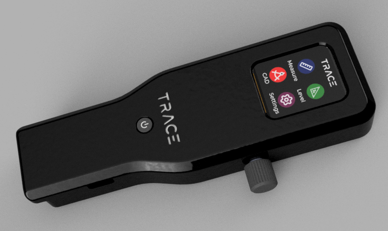

# TRACE Device

**TRACE (Tool for Rapid Analysis, Calibration and Evaluation)** is a compact, modular, multi-sensor embedded device designed for real-time measurement and display of spatial data. The device integrates various sensors with an interactive graphical interface to support tasks such as precision distance measurement, orientation tracking, and heading detection.

{ width="300" }

## Overview

TRACE is engineered to provide accurate, multi-modal measurement capabilities in a portable form factor. It features a 1.69" full-color IPS LCD and an intuitive rotary encoder-based navigation system, allowing users to interact with the device across multiple modes. The platform is suitable for applications in prototyping, CAD sketching, mobile robotics, and on-site field measurements.

## Key Features

- **Distance Measurement**
  - Time-of-Flight (ToF) sensor for short-to-mid range distance readings
  - Magnetic rotary encoder for linear displacement or rolling distance tracking
- **Orientation and Heading**
  - 9-axis IMU (accelerometer, gyroscope, magnetometer)
  - Real-time computation and display of roll, pitch, and yaw
- **Display and UI**
  - 1.69" IPS LCD display (240x280 pixels)
  - LVGL-based graphical UI with animated transitions and interactive menus
- **User Input**
  - Rotary encoder with button functionality for intuitive control
- **Core Hardware**
  - ESP32-WROOM microcontroller with integrated Wi-Fi and BLE support

## Hardware Components

| Component           | Specification / Model                      |
|---------------------|---------------------------------------------|
| Microcontroller      | ESP32-WROOM Module                         |
| Display              | Waveshare 1.69" LCD (SPI, 240×280, IPS)    |
| IMU                  | BNO055 (or compatible 9-axis IMU)          |
| ToF Sensor           | VL53L0X / VL53L1X                          |
| Magnetic Encoder     | AS5600 Magnetic Rotary Encoder             |
| Input                | KY-040 Rotary Encoder with push button     |
| Power Supply         | Li-ion battery with USB charging support   |
| Enclosure            | 3D printed, ergonomic enclosure            |

---

## Software Architecture

The firmware is developed using the Arduino framework and structured for clarity and modularity:
```
src/
├── main.cpp              # Main entry point
├── display.cpp/h         # LVGL UI and rendering logic
├── sensors.cpp/h         # IMU, ToF, and Encoder data management
├── navigation.cpp/h      # Rotary encoder input handling
├── events.cpp/h          # Event callbacks for UI elements
```

- **UI Library**: [LVGL v9+](https://lvgl.io/)
- **Development Environment**: PlatformIO (recommended) or Arduino IDE
- **Optional**: FreeRTOS integration for multi-tasking

## Build and Upload Instructions

### Prerequisites

- [PlatformIO CLI](https://platformio.org/)
- Supported USB driver for ESP32
- Correct wiring of all sensors and peripherals

### PlatformIO Build Steps

```bash
git clone https://github.com/tejaswisam/trace_device.git
cd trace_device
platformio run
platformio upload
````

## Measurement Modes

1. **Laser Ranging Mode**

   * Initiates a 3-second rolling average using the ToF sensor
2. **Rolling Distance Mode**

   * Uses encoder input to track movement distance
3. **Orientation Mode**

   * Displays real-time orientation using the IMU
4. **Settings**

   * Placeholder for calibration and device configuration options

---

## Project Goals and Use Cases

* Portable spatial data capture for CAD integration
* Indoor measurement in constrained or GPS-denied environments
* Robotic mapping and sensor fusion applications
* Educational demonstrations of embedded systems and sensor integration

---

## Future Development

* Wi-Fi/Bluetooth data export
* DXF or SVG generation from encoder + IMU paths
* SD card support for offline data logging
* Mobile application interface for live visualization

---

## License

This project is licensed under the [MIT License](LICENSE). You are free to use, modify, and distribute this software under the terms of the license.

---

## Contribution Guidelines

Contributions are welcome and encouraged. Please follow these steps:

1. Fork the repository
2. Create a feature branch (`git checkout -b feature-name`)
3. Commit your changes with clear messages
4. Push to your fork and open a pull request

---

## Contact

For questions, support, or collaboration inquiries, please open a GitHub issue or contact the maintainers at `<tejaswisamavedula@gmail.com>`.
